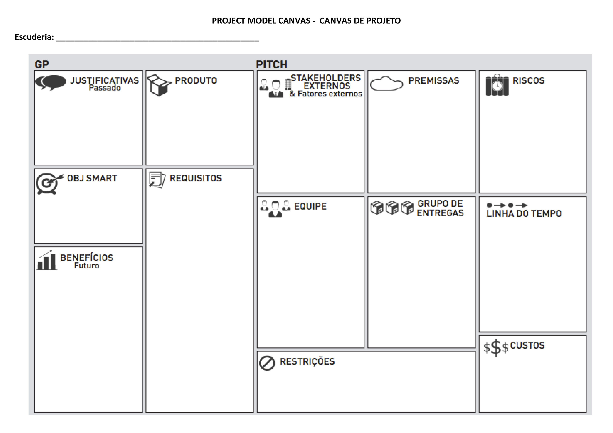

# projeto jornade de aprendizagem 1:
## temas:
- estruturar o correto fluxo de descarte de Equipamentos de Proteção Individual (EPI) → regulamentações em vigor
- implementar registros eletrônicos ou físicos → evidência das movimentações e descarte
    Indústria parceira: [Guindastes Ribas LTDA](https://www.guindastesribas.com/)

## documentação
canvas base:

**implementar/add atalhos via md do que faltou**

## ideias gerais:
- inventário interno 
- automatizar alertas de trocas e vencimentos (Lucas)
- vender a parte de metal do cinto
- vender a parte têxtil do cinto
- novos fornecedores, talvez?
## requerimentos
- SQLAlchemy                   2.0.43
- pyinstaller                  6.15.0
- pyinstaller-hooks-contrib    2025.8
- PySide6                      6.10.2
- PySide6_Addons               6.10.2
- PySide6_Essentials           6.10.2